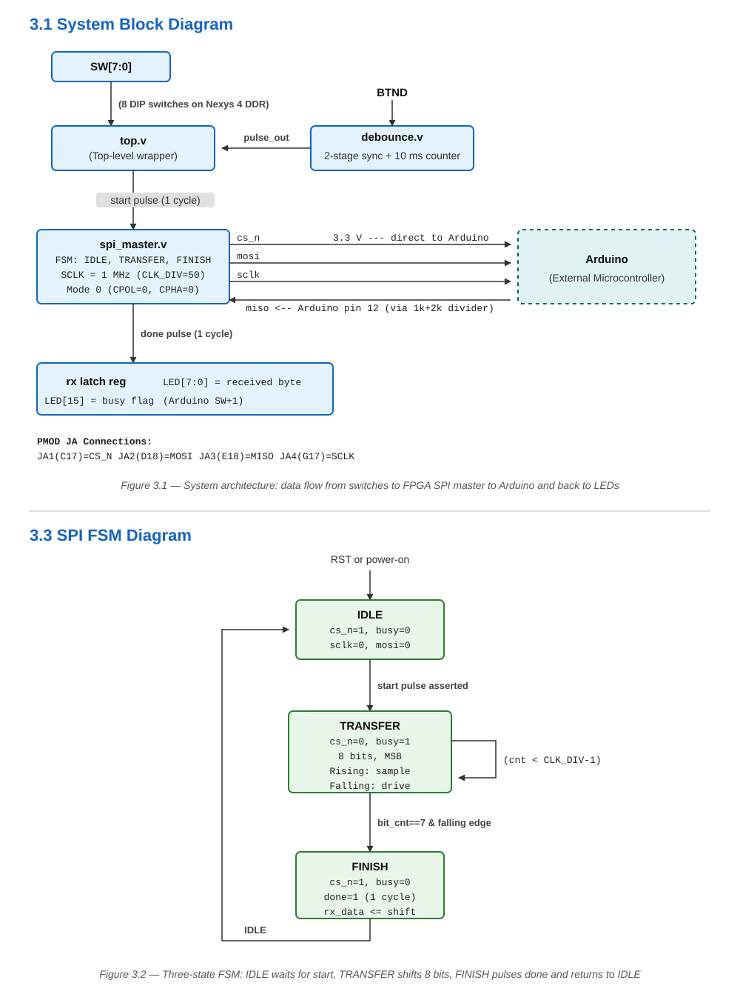
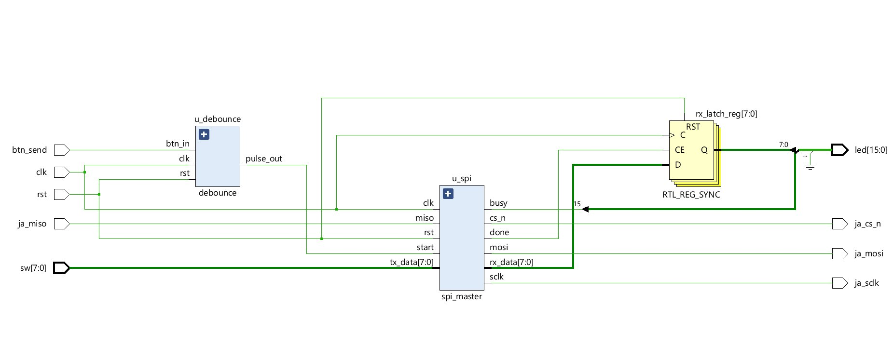
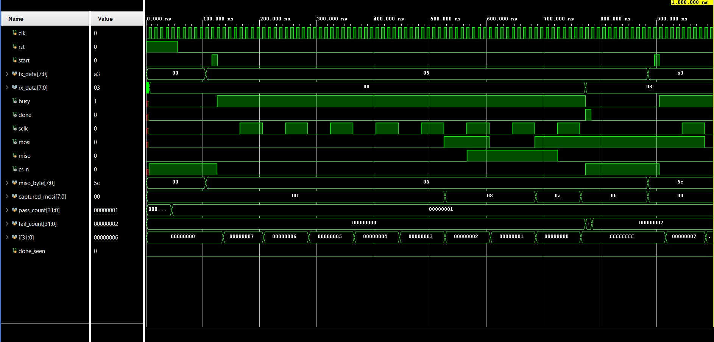
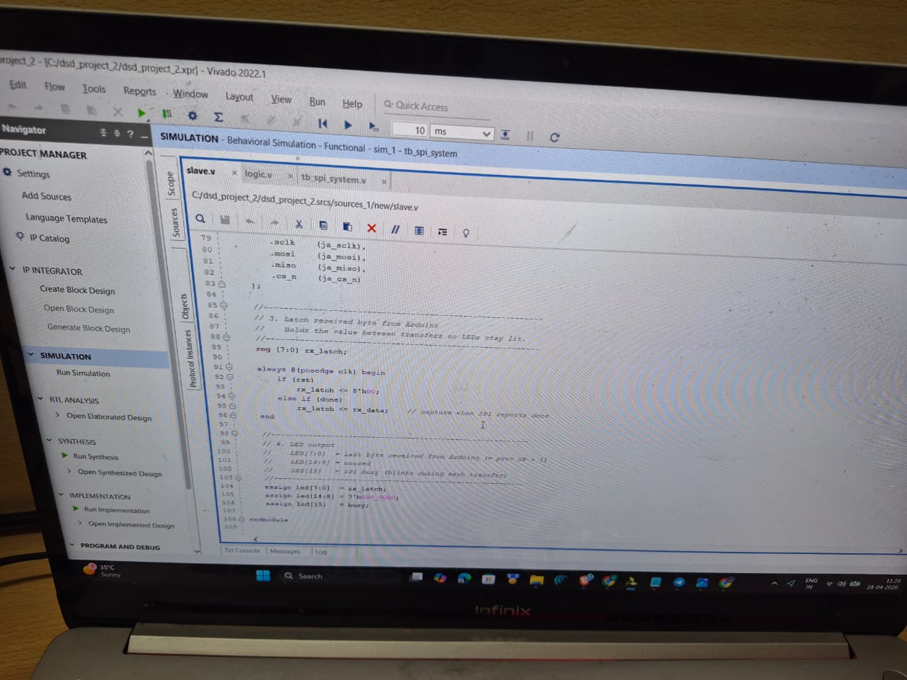
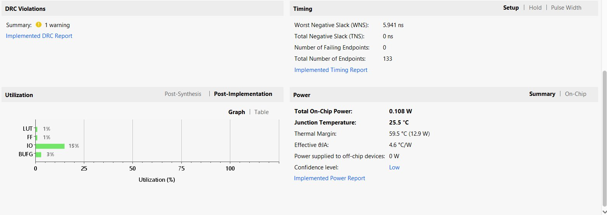
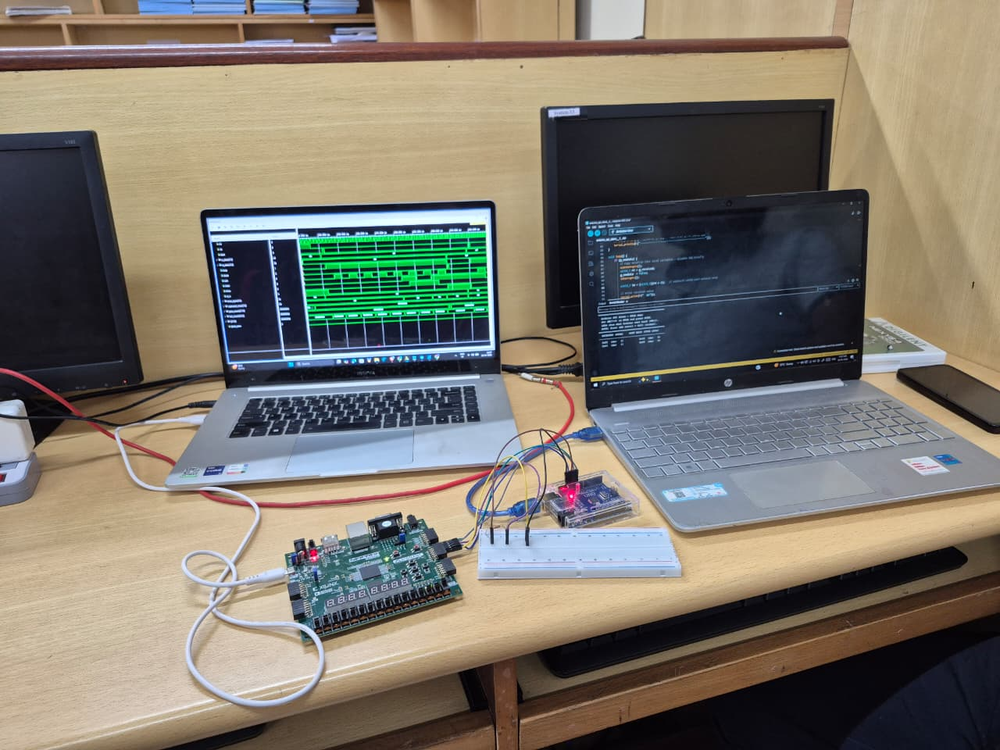
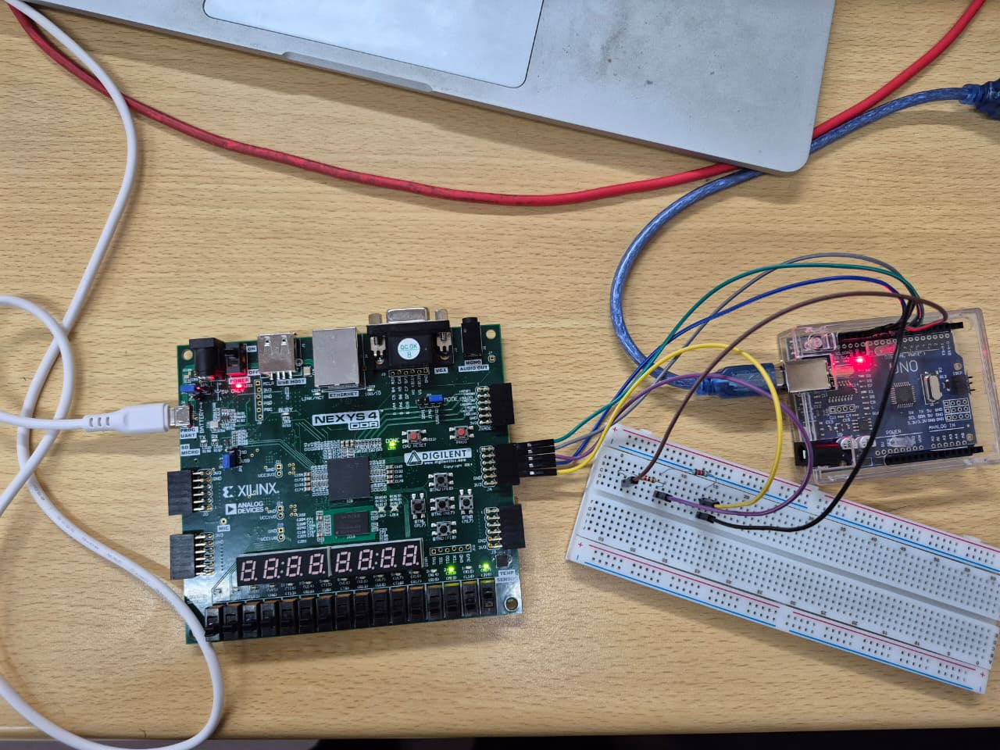
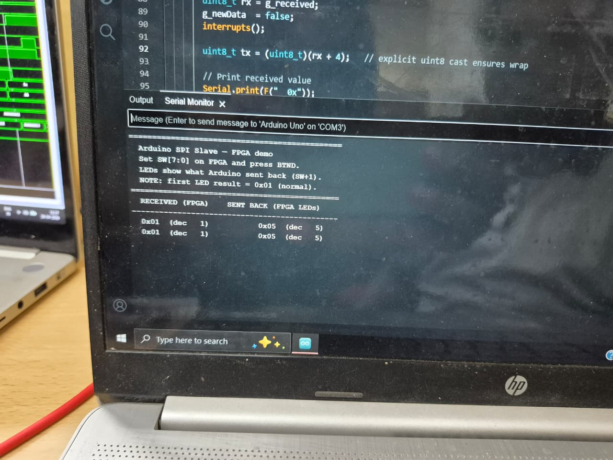

<h1 align="center">SPI Master Communication Interface on FPGA</h1>

<p align="center">
  <strong>Hardware-Verified SPI Master (Mode 0, 1 MHz) in Verilog on Nexys 4 DDR FPGA Interfaced with Arduino Uno SPI Slave</strong>
</p>

<p align="center">
  
  
  
  
  
  
</p>

---

## Table of Contents

- [Overview](#overview)
- [Key Features](#key-features)
- [System Architecture](#system-architecture)
- [Module Descriptions](#module-descriptions)
- [SPI Protocol and Timing](#spi-protocol-and-timing)
- [Voltage Level Protection](#voltage-level-protection)
- [Project Structure](#project-structure)
- [Getting Started](#getting-started)
- [Pin Mapping](#pin-mapping)
- [Simulation Results](#simulation-results)
- [Implementation Results](#implementation-results)
- [Hardware Demonstration](#hardware-demonstration)
- [Technical Challenges and Mitigation](#technical-challenges-and-mitigation)
- [Tech Stack](#tech-stack)
- [References and Sources](#references-and-sources)
- [Authors](#authors)
- [License](#license)

---

## Overview

This project implements a full-duplex **Serial Peripheral Interface (SPI) Master** operating in **Mode 0 (CPOL=0, CPHA=0)** on a **Xilinx Artix-7 FPGA (Nexys 4 DDR)** using Verilog HDL. The FPGA master interfaces over Pmod expansion headers with an **Arduino Uno (ATmega328P)** operating as a hardware SPI slave.

The system allows interactive full-duplex data exchange:
1. The user configures an 8-bit parallel byte on DIP switches `SW[7:0]`.
2. Pressing push-button `BTND` triggers a debounced, single-cycle start command.
3. The FPGA transmits the byte MSB-first over MOSI at a 1 MHz SPI clock (`SCLK`).
4. Simultaneously, the Arduino slave receives the byte via SPI interrupt (`ISR(SPI_STC_vect)`), prints the received value to the Serial Monitor at 115200 baud, increments the value by one (`SW+1`), and returns the incremented byte over MISO.
5. The FPGA captures the slave response, latches it into a output register on `done`, and displays it on `LED[7:0]`. `LED[15]` acts as a live transaction busy indicator.

---

## Key Features

| Feature | Description |
|---|---|
| **SPI Mode 0 Master** | CPOL=0, CPHA=0 with MOSI driven on falling SCLK and MISO sampled on rising SCLK |
| **Synchronous Clock Division** | 1 MHz SPI clock derived synchronously from 100 MHz system clock (`CLK_DIV = 50`) |
| **Robust Debouncer** | 2-stage synchronizer + 20-bit stable counter (10 ms threshold) + edge detector |
| **Output Data Persistence** | Dedicated `rx_latch` holds received slave data on LEDs until next transaction |
| **Over-Voltage Protection** | Passive 1 kΩ / 2 kΩ voltage divider on 5V Arduino MISO line to protect 3.3V FPGA pin |
| **Full Hardware Verification** | Tested across multiple data patterns with live Serial Monitor verification |
| **Minimal Resource Usage** | Uses <1% LUTs (<25 LUTs), <1% Flip-Flops (<40 FFs), 0.108 W total on-chip power |
| **Timing Closure** | Clean timing with Worst Negative Slack WNS = +5.941 ns on 100 MHz clock |

---

## System Architecture

The design uses a modular hardware architecture decoupled into button debouncing, finite state machine control, SPI shift registers, and top-level pin routing.

```
                     +-------------------------------------------------------------+
                     | Top Module (top.v)                                          |
                     |                                                             |
   btn_send (BTND) ->|  +--------------------+   start_pulse                       |
                     |  |  Debouncer         +------------------+                  |
                     |  |  (debounce.v)      |                  |                  |
                     |  +--------------------+                  v                  |
   sw[7:0] --------->|                                +-------------------+        |
                     |                                | SPI Master FSM    |        |===> ja_cs_n, ja_sclk, ja_mosi
                     |                                | (spi_master.v)    |<==>    |     (Pmod JA to Arduino)
   ja_miso --------->|                                +---------+---------+        |
                     |                                          | rx_data          |
                     |                                          v                  |
                     |                                +-------------------+        |
                     |                                | RX Latch Register |------->|===> led[7:0] (Received SW+1)
                     |                                +-------------------+        |===> led[15]  (Busy Flag)
                     +-------------------------------------------------------------+
```

### Finite State Machine (FSM)

The SPI master controller is implemented as a 3-state Mealy/Moore FSM:

1. **`IDLE` (2'b00)**: Assert `CS_N = 1`, `SCLK = 0`, `busy = 0`. Remains in `IDLE` until `start` pulse goes HIGH. Upon `start`, latches `tx_data` into an internal shift register, resets bit counter to 7, asserts `busy = 1`, and transitions to `TRANSFER`.
2. **`TRANSFER` (2'b01)**: Drives `CS_N = 0`. Clock divider generates `SCLK`.
   - On **falling SCLK edge**: Drives `MOSI = shift_reg[7]`.
   - On **rising SCLK edge**: Samples `MISO` into `rx_shift_reg`, left-shifts `shift_reg`, and decrements bit counter.
   - When 8 bits complete (bit count reaches 0), transitions to `FINISH`.
3. **`FINISH` (2'b10)**: Asserts `CS_N = 1`, pulses `done = 1` for exactly one system clock cycle, updates `rx_data`, de-asserts `busy`, and returns to `IDLE`.

<p align="center">
  
</p>
<p align="center"><em>SPI Master 3-state Finite State Machine Diagram</em></p>

### Vivado RTL Schematic

<p align="center">
  
</p>
<p align="center"><em>Vivado-generated RTL schematic showing module hierarchy and top-level interconnection</em></p>

---

## Module Descriptions

| Module | Source File | Function |
|---|---|---|
| **`spi_master`** | `code/spi_master.v` | Core SPI Master controller. Contains 3-state FSM, 100 MHz-to-1 MHz clock divider, 8-bit TX/RX shift registers, and SPI mode 0 bit-timing logic. |
| **`debounce`** | `code/debounce.v` | Push-button debouncer. Includes a 2-flip-flop synchronizer (metastability protection), 20-bit stable counter (10 ms at 100 MHz), and single-cycle rising-edge pulse generator. |
| **`top`** | `code/top.v` | Top-level wrapper module. Connects push button debouncer to SPI master, routes FPGA DIP switches and LEDs, and implements the `rx_latch` register updated on `done`. |
| **`arduino_spi_slave`** | `code/arduino_spi_slave.ino` | C++ sketch for Arduino Uno. Configures hardware SPI in Slave mode (`SPE=1`), uses SPI transfer complete interrupt `ISR(SPI_STC_vect)` for low latency, prints received byte to Serial Monitor, and pre-loads `SPDR = received_byte + 1`. |

---

## SPI Protocol and Timing

The system implements **SPI Mode 0**:
- **Clock Polarity (`CPOL = 0`)**: SPI clock `SCLK` is idle LOW.
- **Clock Phase (`CPHA = 0`)**: Data is driven on the **falling edge** of `SCLK` and sampled on the **rising edge** of `SCLK`.
- **Frame Format**: 8-bit, MSB-first. `CS_N` stays LOW for the full duration of the 8-bit frame.

```
       __                                                                 __
CS_N     \_______________________________________________________________/
            _    _    _    _    _    _    _    _    _    _    _    _
SCLK   ____/ \__/ \__/ \__/ \__/ \__/ \__/ \__/ \__/ \__/ \__/ \__/ \____
       ____ ___________________________________________________________ ____
MOSI   ____X____D7___X____D6___X____D5___X____D4___X____D3___X____D2___X____
       ____ ___________________________________________________________ ____
MISO   ____X____Q7___X____Q6___X____Q5___X____Q4___X____Q3___X____Q2___X____
```

---

## Voltage Level Protection

The Nexys 4 DDR FPGA I/O pins operate at **3.3V LVCMOS33** (maximum safe input voltage: 3.6V). The Arduino Uno outputs signals at **5V TTL logic**.

- **FPGA Output Pins (`MOSI`, `SCLK`, `CS_N`)**: Connected directly from FPGA Pmod JA to Arduino pins 11, 13, and 10. The 3.3V HIGH level exceeds the Arduino ATmega328P minimum input high threshold (`V_IH = 2.0V`), ensuring reliable reception without level shifting.
- **Arduino MISO Pin (Arduino pin 12 -> FPGA JA pin 3)**: A passive voltage divider is inserted on the breadboard:

```
V_MISO = V_Arduino * [ R2 / (R1 + R2) ] = 5.0V * [ 2kΩ / (1kΩ + 2kΩ) ] ≈ 3.33V
```

This safely steps down the 5V Arduino output to 3.33V before entering the FPGA.

---

## Project Structure

```
spi_fpga_latex_final/
├── README.md                       # Main project documentation
├── SOURCES.md                      # Comprehensive reference list
├── .gitignore                      # Git configuration for build artifacts
│
├── code/
│   ├── top.v                       # Top-level wrapper module
│   ├── spi_master.v                # SPI Master FSM & shift registers
│   ├── debounce.v                  # Button debouncer & synchronizer
│   ├── nexys4ddr.xdc               # Vivado physical constraints file
│   ├── tb_spi_system.v             # Self-checking simulation testbench
│   └── arduino_spi_slave.ino       # Arduino Uno SPI slave C++ sketch
│
└── images/
    ├── rtl_schematic.png           # Vivado RTL schematic
    ├── fsm_diagram.svg             # SPI FSM state transition diagram
    ├── waveform.png                # Vivado simulation waveform capture
    ├── implementation_summary.png  # Post-implementation resource & timing report
    ├── demo_hardware_closeup.jpg.jpeg # Close-up photo of FPGA & Arduino wiring
    ├── demo_full_setup.jpg.jpeg    # Full lab hardware test bench photo
    ├── demo_serial_monitor.jpg.jpeg# Arduino Serial Monitor evidence photo
    └── demo_vivado_code.jpg.jpeg   # Vivado simulation workspace photo
```

---

## Getting Started

### Prerequisites

- **Xilinx Vivado 2022.1** (or later) — [Download](https://www.xilinx.com/support/download.html)
- **Arduino IDE 2.x** — [Download](https://www.arduino.cc/en/software)
- **Hardware**:
  - Digilent Nexys 4 DDR FPGA board (Artix-7 XC7A100T-1CSG324C)
  - Arduino Uno (ATmega328P)
  - Breadboard, jumper wires
  - Resistors: 1 kΩ and 2 kΩ (for MISO voltage divider)

### Hardware Setup and Connections

Connect Pmod JA on the Nexys 4 DDR to the Arduino Uno as follows:

| Signal | Nexys 4 DDR Pin | Arduino Uno Pin | Connection Details |
|---|---|---|---|
| `CS_N` | Pmod JA Pin 1 (C17) | Pin 10 (SS) | Direct jumper wire |
| `MOSI` | Pmod JA Pin 2 (D18) | Pin 11 (MOSI) | Direct jumper wire |
| `MISO` | Pmod JA Pin 3 (E18) | Pin 12 (MISO) | Through 1kΩ/2kΩ Voltage Divider |
| `SCLK` | Pmod JA Pin 4 (G17) | Pin 13 (SCK) | Direct jumper wire |
| `GND`  | Pmod JA Pin 5 (GND) | GND Pin | Direct Ground reference wire |

### 1. Arduino Slave Setup

1. Open `code/arduino_spi_slave.ino` in Arduino IDE.
2. Select Board **Arduino Uno** and the corresponding COM port.
3. Upload the sketch to the Arduino Uno.
4. Open the Serial Monitor and set the baud rate to **115200 baud**.

### 2. Vivado Project Build

1. Launch Vivado 2022.1 and create a new RTL Project targeting device `xc7a100tcsg324-1`.
2. Add Design Sources from `code/`: `top.v`, `spi_master.v`, `debounce.v`. Set `top` as the top module.
3. Add Constraints File: `code/nexys4ddr.xdc`.
4. Add Simulation Source: `code/tb_spi_system.v`.
5. Run **Synthesis** -> **Implementation** -> **Generate Bitstream**.
6. Connect the Nexys 4 DDR board via USB-JTAG, open **Hardware Manager**, and program the FPGA.

---

## Pin Mapping

| Signal | Nexys 4 DDR Pin | IOSTANDARD | Description |
|---|---|---|---|
| `clk` | E3 | LVCMOS33 | 100 MHz system oscillator |
| `rst` | N17 | LVCMOS33 | Centre push button (BTNC) — active-HIGH reset |
| `btn_send` | P18 | LVCMOS33 | Down push button (BTND) — trigger SPI transfer |
| `sw[7:0]` | J15, L16, M13, R15, R17, T18, U18, R13 | LVCMOS33 | DIP switches — byte to transmit |
| `led[7:0]` | H17, K15, J13, N14, R18, V17, U17, U16 | LVCMOS33 | LEDs — received byte display (`SW+1`) |
| `led[15]` | V11 | LVCMOS33 | LED15 — busy flag (HIGH during transfer) |
| `ja_cs_n` | C17 | LVCMOS33 | Pmod JA Pin 1 — SPI Chip Select (`CS_N`) |
| `ja_mosi` | D18 | LVCMOS33 | Pmod JA Pin 2 — Master Out Slave In (`MOSI`) |
| `ja_miso` | E18 | LVCMOS33 | Pmod JA Pin 3 — Master In Slave Out (`MISO`) |
| `ja_sclk` | G17 | LVCMOS33 | Pmod JA Pin 4 — SPI Clock (`SCLK`, 1 MHz) |

---

## Simulation Results

A comprehensive, self-checking Verilog testbench (`code/tb_spi_system.v`) was created to verify the FSM transitions, bit shifting, and timing parameters prior to hardware deployment.

### Test Bench Coverage

The testbench automatically validates 7 distinct operational test cases:
1. **Reset Test**: Verifies all control signals (`CS_N`, `SCLK`, `MOSI`, `busy`, `done`) remain cleared during reset.
2. **Normal Data Transfer**: Transmits `0x05` with slave response `0x06`, verifying bit alignment.
3. **Alternating Bit Pattern**: Transmits `0xA3` (`10100011`) with slave response `0x5C`.
4. **Boundary Condition 1**: Transmits `0x00` with slave response `0xFF`.
5. **Boundary Condition 2**: Transmits `0xFF` with slave response `0x00`.
6. **Back-to-Back Transfers**: Verifies immediate second transaction capability.
7. **Done Signal Width**: Verifies `done` remains HIGH for exactly one system clock cycle.

<p align="center">
  
</p>
<p align="center"><em>Vivado Behavioral Simulation Waveform: SPI Mode 0 transactions showing SCLK, MOSI, MISO, and CS_N timing</em></p>

<p align="center">
  
</p>
<p align="center"><em>Vivado 2022.1 simulation workspace during testbench execution</em></p>

---

## Implementation Results

<p align="center">
  
</p>

### Resource Utilization (Artix-7 XC7A100T)

| Resource | Used | Available | Utilization |
|---|---|---|---|
| **LUT** (Lookup Table) | ~25 | 63,400 | **< 1%** |
| **FF** (Flip-Flop) | ~40 | 126,800 | **< 1%** |
| **I/O Pins** | 19 | 210 | **9%** |
| **BUFG** (Global Clock Buffer) | 1 | 32 | **3%** |
| **BRAM** | 0 | 135 | **0%** |
| **DSP Slices** | 0 | 240 | **0%** |

### Timing and Power Analysis

| Metric | Measured Value | Constraint / Limit | Status |
|---|---|---|---|
| **Worst Negative Slack (WNS)** | **+5.941 ns** | 10.00 ns (100 MHz) | Met (Zero Endpoints Failing) |
| **Total Negative Slack (TNS)** | **0.000 ns** | 0.000 ns | Met |
| **Max Theoretical Frequency** | **~247 MHz** | 100 MHz | Passed with 4.059 ns slack |
| **Total On-Chip Power** | **0.108 W** | - | Low Power |
| **Junction Temperature** | **25.5 C** | 85.0 C | Thermal Margin: 59.5 C |

---

## Hardware Demonstration

The system was fully verified in hardware across multiple test iterations. The images below illustrate the physical setup and verified operation:

<p align="center">
  
</p>
<p align="center"><em>Full Hardware Test Bench: Vivado workstation (left), Arduino IDE Serial Monitor (right), and interconnected FPGA-Arduino hardware (center)</em></p>

<p align="center">
  
</p>
<p align="center"><em>Close-up view of Nexys 4 DDR Pmod JA connected to Arduino Uno via breadboard with MISO voltage divider</em></p>

### Hardware Verification Log

| Test # | `SW[7:0]` Input (Hex) | Byte Sent to Arduino | Arduino Serial Monitor Output | Arduino Return Byte (`SW+1`) | FPGA `LED[7:0]` Display | Result |
|---|---|---|---|---|---|---|
| 1 | `0x05` (5) | `0x05` | `Received: 0x05 -> Sent: 0x06` | `0x06` | `0x06` (6) | PASSED |
| 2 | `0x0F` (15) | `0x0F` | `Received: 0x0F -> Sent: 0x10` | `0x10` | `0x10` (16) | PASSED |
| 3 | `0xA3` (163) | `0xA3` | `Received: 0xA3 -> Sent: 0xA4` | `0xA4` | `0xA4` (164) | PASSED |
| 4 | `0xFF` (255) | `0xFF` | `Received: 0xFF -> Sent: 0x00` | `0x00` | `0x00` (0, overflow) | PASSED |
| 5 | `0x00` (0) | `0x00` | `Received: 0x00 -> Sent: 0x01` | `0x01` | `0x01` (1) | PASSED |

<p align="center">
  
</p>
<p align="center"><em>Live Serial Monitor Log confirming byte reception from FPGA and incremented reply generation</em></p>

---

## Technical Challenges and Mitigation

| # | Technical Challenge | Root Cause | Engineering Solution |
|---|---|---|---|
| 1 | **Push-Button Bounce and Metastability** | Mechanical push button contacts bounce for several milliseconds, causing multiple premature triggers. Asynchronous input relative to 100 MHz system clock creates flip-flop metastability. | Implemented a 2-stage synchronizer (`sync_0`, `sync_1`), followed by a 20-bit stable counter requiring 1,000,000 continuous identical clock cycles (10 ms at 100 MHz) before updating output level. A rising-edge pulse generator produces a clean single-cycle `start` pulse. |
| 2 | **5V TTL to 3.3V LVCMOS I/O Voltage Mismatch** | Arduino Uno MISO pin outputs 5V logic, which exceeds the absolute maximum rated input voltage (3.6V) of the Artix-7 FPGA I/O pins. | Designed a passive 1 kΩ / 2 kΩ resistor voltage divider on the MISO breadboard line, stepping down 5.0V to 3.33V. FPGA outputs (3.3V) natively satisfy Arduino $V_{IH} \ge 2.0\text{V}$ without level shifters. |
| 3 | **SPI Mode 0 Timing Alignment** | Sampling MISO on the incorrect clock edge leads to off-by-one bit corruption or sampling during signal transitions. | Strictly aligned FSM to Mode 0 requirements: MOSI data is updated on the **falling edge** of `SCLK`, providing half a clock cycle (~500 ns setup time) before MISO is sampled on the **rising edge** of `SCLK`. |
| 4 | **First-Transaction SPI Slave Pre-load Issue** | In full-duplex SPI, the slave must pre-load its data register (`SPDR`) *before* the master initiates clocking for the transaction. On the very first transfer, default `SPDR` content was transmitted. | Updated Arduino slave software to pre-load `SPDR` during `setup()` and within `ISR(SPI_STC_vect)` immediately following byte reception, guaranteeing valid return data on every subsequent frame. |
| 5 | **LED Display Flicker Between Transactions** | Dynamic internal signals reset output registers when SPI master returns to IDLE state, causing LEDs to turn off. | Designed a dedicated `rx_latch` register in `top.v` that updates strictly on the rising edge of the single-cycle `done` flag, persisting received data on LEDs until overwritten by the next transaction. |

---

## Tech Stack

| Component / Layer | Name / Standard | Role |
|---|---|---|
| **Hardware Description Language** | Verilog HDL (IEEE 1364-2001) | Synthesisable digital logic design and testbench |
| **FPGA Development Board** | Digilent Nexys 4 DDR (Rev C) | Target implementation platform |
| **FPGA Silicon** | Xilinx Artix-7 XC7A100T-1CSG324C | Target FPGA device |
| **Microcontroller / Slave Device** | Arduino Uno (ATmega328P) | External SPI hardware slave device |
| **EDA Toolchain** | Xilinx Vivado Design Suite 2022.1 | Synthesis, Implementation, Bitstream, and Simulation |
| **Embedded Firmware** | Arduino C++ (AVR-GCC) | Hardware SPI slave ISR driver |
| **Hardware Interconnect** | Pmod JA Expansion Header | 4-wire SPI physical interface |

---

## References and Sources

> For a complete list of textbooks, standards, application notes, and data sheets, see [**SOURCES.md**](SOURCES.md).

1. Digilent Inc., *Nexys 4 DDR Reference Manual* — [Reference Link](https://reference.digilentinc.com/nexys4-ddr)
2. Xilinx Inc., *7 Series FPGAs Data Sheet: Overview (DS180)* — [Documentation Link](https://www.xilinx.com/support/documentation/data_sheets/ds180_7Series_Overview.pdf)
3. Xilinx Inc., *Vivado Design Suite User Guide: Using Constraints (UG903)*, 2022
4. Microchip Technology Inc., *ATmega328P 8-bit AVR Microcontroller Datasheet*
5. IEEE, *Standard Verilog Hardware Description Language — IEEE Std 1364-2001*
6. P. J. Ashenden, *The Student's Guide to VHDL*, 2nd ed., Morgan Kaufmann, 2008
7. Pong P. Chu, *RTL Hardware Design Using Verilog*, Wiley-IEEE Press, 2006

---

## Authors

| Name | Role |
|---|---|
| **Molik Rajvanshi** | Architecture, Verilog Design, FPGA Implementation, Verification |
| **Ujjawal Khatri** | System Design, Arduino Firmware, Hardware Verification |

---

## License

This project is open for educational, academic, and personal use. Feel free to reference, fork, or build upon this implementation.
